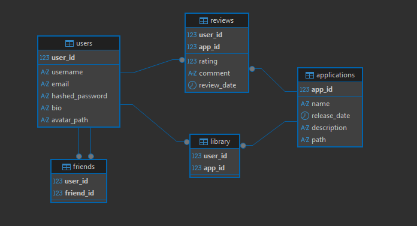

# Installing and Running Backend

This backend uses Flask with a local MySQL database.

## Prerequisites

- Python 3
- MySQL running locally

## Create `.venv` in `BackEnd/src`

```sh
cd BackEnd/src
python3 -m venv .venv
source .venv/bin/activate
```

## Install Modules

```sh
pip install mysql-connector-python flask
```

## Create Database

From `BackEnd/src`, run:

```sh
python create_database.py
```

Press Enter at each prompt to use the local defaults:

- Host: `localhost`
- Port: `3306`
- User: `root`
- Password: empty

## Run Server

From `BackEnd/src`, run:

```sh
python server.py
```

If your local MySQL root user has a password, set it before running the server:

```sh
export RUDIMENTARY_STEAM_DB_PASSWORD="your_password"
python server.py
```

The server runs at `http://127.0.0.1:5000`.

## Current API Support

### GET Requests

- `/api/applications` returns a list of applications in the database.
- `/api/application?id=12` returns an application by id.
- `/api/users` returns a list of users in the database.
- `/api/user?id=1` returns a user by id.

### POST Requests

- `/api/user` adds a user.

```sh
curl -X POST http://localhost:5000/api/user \
  -H "Content-Type: application/json" \
  -d '{"username":"UserThree","email":"userthree@example.com","hashed_password":"password","bio":"","avatar":"","friend_list":"[]","library":"[]"}'
```

- `/api/application` adds an application.

```sh
curl -X POST http://localhost:5000/api/application \
  -H "Content-Type: application/json" \
  -d '{"name":"app1","release_date":"2026-04-16","description":"This is an app.","path":"This will not be in later commands"}'
```

## Feature Plans

- User login
- User is able to download and leave reviews
- Executable download

## Schema Diagram


